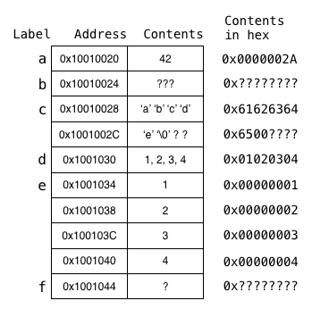

# Week 03 Tutorial
 
Mips data, memory and arrays

2. If the data segment starts and `0x10010020`, at what addresses are the following labels? What value is stored in each memory cell?

>Remember that MIPS requires types of n bytes to be stored at addresses that are divisible by n

```
    .data
a:  .word   42
b:  .space  4
c:  .asciiz "abcde"
    .align  2
d:  .byte   1, 2, 3, 4
e:  .word   1, 2, 3, 4
f:  .space  1

array: .space 4, 4, 4, 4, 4
```


3. Give MIPS directives for the following variables:
> NB: we are placing the variables in memory, with byte aligned addresses. The labels should match the variable name for consistency.

```
int u;          -->
int v = 42;     -->
char w;         -->
char x = 'a';   -->
double y;       -->
int z[20];      -->
```
4. For the following memory state, calculate the addresses and what values will be loaded into `$t0` after each (pair) of statement(s)
```
Address       Data Definition
0x10010000    aa:  .word 42
0x10010004    bb:  .word 666 -> 0x0000029a, 2*16^(2) + 9 * 16^(1) + A(10)* 16^(0)
0x10010008    cc:  .word 1
0x1001000C         .word 3
0x10010010         .word 5
0x10010014         .word 7

la   $t0, aa        --> 0x10010000

lw   $t0, bb        --> 666

lb   $t0, bb        -->

lw   $t0, aa+4      -->

la   $t1, cc
lw   $t0, ($t1)     -->

la   $t1, cc        
lw   $t0, 8($t1)    -->

li   $t1, 8         
lw   $t0, cc($t1)   -->

la   $t1, cc        
lw   $t0, 2($t1)    -->
```

9. 
```
char *string = "....";
char *s = &string[0];
int   length = 0;
while (*s != '\0') {
   length++;  // increment length
   s++;       // move to next char
}
```
